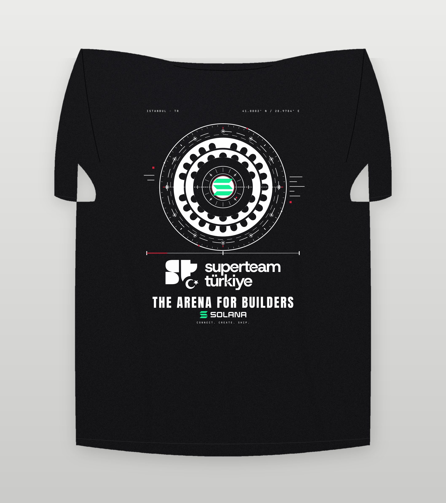

# SuperteamTR T-Shirt — *ARENA PROTOCOL*

Production-ready T-shirt design for **SuperteamTR**, the Turkish chapter of the
global Superteam network (Solana ecosystem builders, creators, developers and
Web3 projects in Türkiye).

The design rebuilds the **Colosseum as a futuristic Web3 arena** seen from
above: a two-tier arcade ring wired like a blockchain network, with the official
**Solana** logomark at its centre, the official **SuperteamTR** lockup beneath
it, and one restrained red accent — the actual SuperteamTR red — carrying the
Turkish identity.



---

## What's in the box

| Folder | Contents |
|---|---|
| `design/final/` | editable SVG masters — back print, front chest, neck label, sleeve mark (dark + light garments) |
| `design/concepts/` | the three concept directions |
| `production/svg/` | build variants: full colour, screen-print build, 2-colour, 1-colour |
| `production/pdf-spot/`, `production/eps-spot/` | **spot-colour (Pantone) files** — every ink is a real `/Separation` plate named after its Pantone reference |
| `production/pdf-cmyk/`, `production/eps-cmyk/` | vector CMYK files for print (PDF review pages / clean EPS artwork) |
| `production/separations/` | screen-print films: 4-ink set + underbase union plate, 2-ink and 1-ink |
| `production/png-300dpi/` | transparent PNG masters, 300 dpi at true print size (back print 3780 × 4724 px) |
| `production/tiff-300dpi/` | CMYK soft proofs (LZW) |
| `production/psd/` | 5 layered PSDs — back print (dark + light), front chest, full-colour back, and an all-panels 1:1 sheet; ink layers named after the spot inks |
| `mockups/` | back / front / flat lay / detail / placement sheet / artwork-only |
| `brand-assets/official/` | the official logo files used, unmodified |
| `fonts/` | the open-licence fonts (outlined in every deliverable) + licence texts |
| `tools/` | the toolkit that regenerates every file above |
| `docs/` | strategy, the three concepts, comparison, production spec, rationale, QC, manifest |

## Print specification (short version)

| | |
|---|---|
| **Back print** | 320 × 400 mm, centred, 95 mm below the neck rib |
| **Front chest** | 90 × 104 mm, 95 mm below the shoulder seam, 95 mm from centre (wearer's right) |
| **Neck label** | 64 × 26 mm inside the back neck · **sleeve mark** 40 mm circle (optional) |
| **Garment** | washed black `#17171A`, 220–260 gsm combed cotton (alt: bone `#E9E4D8`) |
| **Inks (spot/Pantone)** | PANTONE White C (underbase) · **199 C** `#D6223B` · **2665 C** `#9945FF` · **338 C** `#28E0B9` · 802 C for the 2-colour build (gradient inside the Solana logomark only) |
| **Type** | Anton + Space Grotesk + JetBrains Mono — all converted to outlines |

Full detail: [`docs/06-print-production-spec.md`](docs/06-print-production-spec.md)

## Documentation

* [01 · Creative strategy](docs/01-creative-strategy.md)
* [02 · Concept 1 — Arena Protocol](docs/02-concept-1-futuristic-arena.md) ·
  [03 · Concept 2 — Sheet 02/03](docs/03-concept-2-blueprint-network.md) ·
  [04 · Concept 3 — The Seal](docs/04-concept-3-premium-minimal-seal.md)
* [05 · Comparison & recommendation](docs/05-comparison-and-recommendation.md)
* [06 · Print-production specification](docs/06-print-production-spec.md)
* [07 · Design rationale](docs/07-design-rationale.md)
* [08 · Quality control (22 automated checks)](docs/08-quality-control.md)
* [09 · Deliverables manifest (every file + hash)](docs/09-deliverables-manifest.md)
* [10 · Brand assets, fonts & licensing](docs/10-assets-and-licensing.md)

## Rebuild everything

```bash
python3 -m pip install -r tools/requirements.txt     # cairosvg, numpy, Pillow, fontTools, uharfbuzz, psd-tools, pypdfium2
python3 tools/build_artwork.py        # design/*.svg + production/svg/* + placement manifests
python3 tools/build_production.py     # PDF / EPS / separations / PNG / TIFF / PSD / palette
python3 tools/build_mockups.py        # mockups/*.png
python3 tools/build_docs.py           # QC report, manifest, asset/licence doc, project state
python3 tools/build_presentation.py   # index.html preview board
```

Change a parameter in `tools/build_artwork.py` (bay count, palette, radii, type
scale) and every deliverable — including the separations and the QC report —
stays consistent.

## Before you print — four sign-offs

1. **Brand approval** of the logo files and of monochrome merchandise usage
   (see `docs/10-assets-and-licensing.md`).
2. **Pantone draw-downs** on press, especially the Solana green and the TR red.
3. **One physical proof** per process (screen + DTG) with a wash test.
4. **Gradient decision** for the press run: full gradient (DTG/DTF) or the
   hard-stop 2-band print build (screen). Both files are already prepared.

---

## Assets & credits

* Official SuperteamTR assets: `tr.superteam.fun/brand/*` (lockup, monogram, badge).
* Official Solana brand kit: `solana.com/src/img/branding/*` (logomark, logotype,
  vertical lockup, Foundation logo) — brand colours `#9945FF` / `#14F195`.
* Fonts: Anton, Space Grotesk, JetBrains Mono — SIL Open Font License 1.1.
* Artwork, toolkit and documentation: original work for SuperteamTR.

All logos remain the property of their owners and are used here for
SuperteamTR community merchandise.
